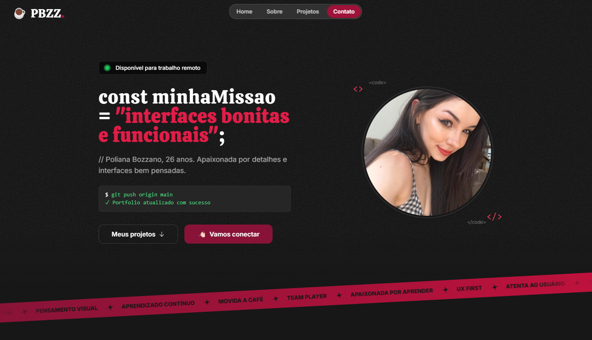

<div align="center">


</div>

<br/>

[](https://git.io/typing-svg)

<p align="center">
  <i>Hi! I'm Poli — a front-end developer in training who loves design, detail, and creating intuitive experiences with code.</i>
</p>

---

### About 

This is my personal portfolio — handcrafted and continually evolving to reflect my growth as a developer.

> Built using modern tools, styled to reflect my personality, and organized to present both my technical skills and creative spirit.


---

### 🚀 Tech Stack

| Tech            | Description                              |
|-----------------|------------------------------------------|
| `React`         | UI library used for structure            |
| `TypeScript`    | Type-safe JavaScript                     |
| `Tailwind CSS`  | Utility-first styling system             |
| `Framer Motion` | Subtle animations & floating elements    |
| `Next.js`       | Routing, optimization, and speed         |

---

### 📸 Preview

> _Quick peek_

<div align="center">
  
  <p><i>Creative, responsive and personal ✨</i></p>
</div>

[Portfolio Website](https://portfolio-six-bice-60.vercel.app)

---

### 🛠️ How to Run Locally

```bash
# Clone the repo
git clone https://github.com/polibozzano/portfolio.git

# Move into the project folder
cd portfolio

# Install dependencies
npm install

# Start the development server
npm run dev
```
--- 


## 📬 Contact

💌 Reach me on LinkedIn: https://www.linkedin.com/in/polianabozzano/
<br/>
📧 Email: polibozzano@gmail.com

<br/>

[](https://git.io/typing-svg)

<div align="center">
  
</div>
